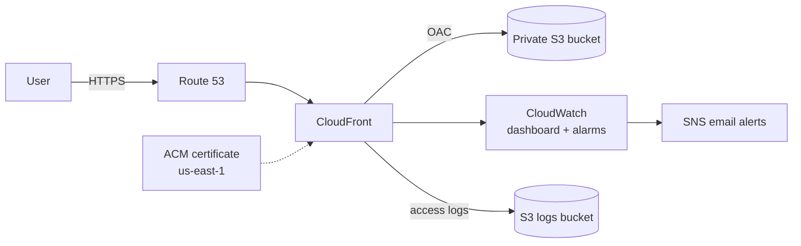

# Secure Static Website Deployment on AWS

Production-style static website deployment on AWS: a **private S3 bucket** served globally through **CloudFront** with **Origin Access Control (OAC)**, HTTPS via **ACM**, DNS via **Route 53**, and monitoring and alerting through **CloudWatch and SNS**.

**Live site:** [kousikvarma.tech](https://kousikvarma.tech)

---

## Architecture

<!-- Add a screenshot of the architecture diagram or the live site here, e.g.  -->

---

## AWS Services

| Service | Role in this project |
| --- | --- |
| **S3** | Private origin for website files; versioning and server-side encryption enabled |
| **CloudFront** | CDN, caching, HTTP to HTTPS redirect, custom domain |
| **Origin Access Control** | Lets only CloudFront read from the private bucket |
| **ACM** | Public TLS certificate for the apex and wildcard domain |
| **Route 53** | Hosted zone and alias records pointing to CloudFront |
| **CloudWatch** | Dashboard plus 4xx and 5xx error-rate alarms |
| **SNS** | Email notifications when an alarm fires |
| **S3 (logs bucket)** | Stores CloudFront access logs |

---

## Configuration Summary

| Item | Value |
| --- | --- |
| Domain | `kousikvarma.tech`, `www.kousikvarma.tech` |
| Website bucket | `kousikvarma.tech-website` (Block Public Access on, versioning on, SSE on, static website hosting **off**) |
| Logs bucket | `kousikvarma.tech-logs` |
| S3 region | `ap-south-2` (Hyderabad) |
| ACM region | `us-east-1` (required for CloudFront certificates) |
| Certificate | `kousikvarma.tech` and `*.kousikvarma.tech`, DNS-validated |
| Default root object | `index.html` |
| Viewer protocol policy | Redirect HTTP to HTTPS |
| Allowed methods | `GET`, `HEAD` |
| DNS records | Alias `A` records for apex and `www` to the CloudFront distribution |

---

## How It Works

1. **Route 53** resolves the domain to the CloudFront distribution through alias records.
2. **CloudFront** terminates HTTPS with the ACM certificate and redirects HTTP to HTTPS.
3. On a cache miss, CloudFront fetches the object from S3 using a signed **OAC** request. The bucket policy allows only this distribution, so the bucket is never public.
4. CloudFront writes access logs to the logs bucket and publishes metrics to CloudWatch.
5. CloudWatch alarms on `4xxErrorRate` and `5xxErrorRate` notify an SNS email topic.

---

## Security Controls

- S3 Block Public Access enabled; no public bucket endpoint
- Access to S3 restricted to CloudFront through OAC
- HTTPS enforced with an ACM-issued certificate
- Server-side encryption at rest on the website bucket
- S3 versioning to recover from accidental overwrites or deletions
- CloudFront access logs for request history

> **Note:** S3 versioning protects against accidental changes but is not an independent backup.

---

## Verification

- [x] `https://kousikvarma.tech` and `https://www.kousikvarma.tech` load over HTTPS
- [x] `http://` requests redirect to `https://`
- [x] Direct S3 object access is denied; content is reachable only through CloudFront
- [x] CloudFront metrics visible in CloudWatch; 4xx and 5xx alarms configured
- [x] CloudFront access logs delivered to the logs bucket

---

## Scope and Trade-offs

| Not included | Reason |
| --- | --- |
| AWS WAF | Left out to avoid its additional cost in this account setup |
| Separate backup bucket | Versioning is used instead of a second copy |

---

## Future Improvements

- CI/CD with GitHub Actions: deploy to S3 and invalidate the CloudFront cache on push
- Infrastructure as code with Terraform or CloudFormation
- Cache behaviors tuned for CSS, JavaScript, and images
- AWS WAF in front of CloudFront
- Cross-Region Replication for disaster recovery
- Enable CloudTrail for account-level auditing
- Additional dashboards and alarms

---

## What This Project Demonstrates

Private-origin CDN delivery, TLS and DNS setup, least-privilege access between services, monitoring and alerting, and log collection on AWS.

**Tech:** S3 · CloudFront · OAC · ACM · Route 53 · CloudWatch · SNS
