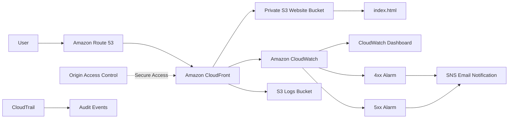

# Secure Static Website Deployment on AWS

A hands-on AWS CloudOps project demonstrating how to deploy a static website using **Amazon S3, Amazon CloudFront, Route 53, AWS Certificate Manager (ACM), CloudWatch, and CloudTrail**.

The website is stored in a **private S3 bucket** and delivered through CloudFront using **Origin Access Control (OAC)**. HTTPS is enabled using an ACM certificate, DNS is managed through Route 53, CloudFront access logs are stored in a separate S3 bucket, and CloudWatch/CloudTrail provide monitoring and auditing.

> **Note:** AWS WAF and a separate backup S3 bucket were intentionally not included in this implementation.

---

## Table of Contents

- [Project Overview](#project-overview)
- [Architecture](#architecture)
- [AWS Services Used](#aws-services-used)
- [Project Resources](#project-resources)
- [Implementation](#implementation)
  - [1. Route 53](#1-route-53)
  - [2. Website S3 Bucket](#2-website-s3-bucket)
  - [3. CloudFront Origin Access Control](#3-cloudfront-origin-access-control)
  - [4. ACM SSL Certificate](#4-acm-ssl-certificate)
  - [5. CloudFront Distribution](#5-cloudfront-distribution)
  - [6. Route 53 DNS Records](#6-route-53-dns-records)
  - [7. CloudFront Logging](#7-cloudfront-logging)
  - [8. CloudWatch Monitoring](#8-cloudwatch-monitoring)
  - [9. CloudTrail Auditing](#9-cloudtrail-auditing)
- [Security Configuration](#security-configuration)
- [S3 Versioning](#s3-versioning)
- [Testing](#testing)
- [Final Architecture Flow](#final-architecture-flow)
- [Project Structure](#project-structure)
- [What This Project Demonstrates](#what-this-project-demonstrates)
- [Future Improvements](#future-improvements)

---

# Project Overview

The objective of this project is to deploy a simple `index.html` static website using an AWS architecture that follows common cloud deployment practices.

Instead of exposing the S3 bucket directly to the internet, the website is kept private and CloudFront is given controlled access through **Origin Access Control (OAC)**.

### Main architecture

```text
User
  |
  | HTTPS
  v
Route 53
  |
  v
CloudFront
  |
  | OAC
  v
Private S3 Bucket
  |
  v
index.html
```

Monitoring and auditing are handled separately:

```text
CloudFront
   |
   +----> CloudWatch
   |         |
   |         +----> Dashboard
   |         +----> 4xx Alarm
   |         +----> 5xx Alarm
   |         +----> SNS Email
   |
   +----> S3 Logs Bucket

AWS Account Activity
   |
   v
CloudTrail
   |
   v
Audit Trail
```

---

# Architecture



---

# AWS Services Used

| AWS Service | Purpose |
|---|---|
| **Amazon S3** | Stores the static website files |
| **Amazon S3 Versioning** | Maintains previous versions of website objects |
| **Amazon CloudFront** | CDN, caching and HTTPS delivery |
| **CloudFront OAC** | Allows CloudFront to securely access the private S3 bucket |
| **AWS Certificate Manager (ACM)** | Provides the SSL/TLS certificate |
| **Amazon Route 53** | Domain DNS management |
| **Amazon CloudWatch** | Monitoring, dashboard and alarms |
| **Amazon SNS** | Sends CloudWatch alarm notifications through email |
| **AWS CloudTrail** | Auditing and recording AWS account activity |
| **Amazon S3 Logging Bucket** | Stores CloudFront access logs |

### Services intentionally not used

| Service | Reason |
|---|---|
| **AWS WAF** | Removed to keep this deployment within the user's intended AWS account/pricing setup |
| **Separate Backup S3 Bucket** | Removed; S3 Versioning is enabled on the main website bucket |

---

# Project Resources

## Domain

```text
kousikvarma.tech
```

## S3 Buckets

### Website Bucket

```text
kousikvarma.tech-website
```

Purpose:

- Stores the website
- Contains `index.html`
- Private bucket
- Public access blocked
- Versioning enabled
- Server-side encryption enabled

### CloudFront Logs Bucket

```text
kousikvarma.tech-logs
```

Purpose:

- Stores CloudFront access logs

## AWS Region

The S3 resources for this project are deployed in:

```text
Asia Pacific (Hyderabad)
ap-south-2
```

> The ACM certificate used by CloudFront is created in **US East (N. Virginia) — us-east-1**, as required for CloudFront certificates.

---

# Implementation

## 1. Route 53

A Route 53 hosted zone was created for:

```text
kousikvarma.tech
```

The domain's nameservers were configured at the domain provider to use the Route 53 hosted zone.

Route 53 is responsible for resolving the custom domain to the CloudFront distribution.

---

## 2. Website S3 Bucket

The website bucket was created as:

```text
kousikvarma.tech-website
```

### Configuration

- Block all public access: **Enabled**
- Versioning: **Enabled**
- Server-side encryption: **Enabled**
- Website hosting: **Not used**
- Website content: `index.html`

The S3 bucket is intentionally kept private.

The website is not accessed directly through a public S3 website endpoint.

Instead:

```text
User
  |
  v
CloudFront
  |
  | OAC
  v
Private S3
```

---

## 3. CloudFront Origin Access Control

An **Origin Access Control (OAC)** was configured for the S3 origin.

OAC allows CloudFront to make authenticated requests to the private S3 bucket.

This prevents the website from requiring public access to S3.

### Access model

```text
Internet
   |
   v
CloudFront
   |
   | Signed request using OAC
   v
Private S3 Bucket
```

---

## 4. ACM SSL Certificate

An ACM public certificate was requested for:

```text
kousikvarma.tech
*.kousikvarma.tech
```

DNS validation was used.

The certificate was issued successfully.

The certificate covers the custom domain and its subdomains, including:

```text
kousikvarma.tech
www.kousikvarma.tech
```

The certificate is located in:

```text
us-east-1
```

because CloudFront requires ACM certificates used with CloudFront to be in US East (N. Virginia).

---

## 5. CloudFront Distribution

A CloudFront distribution was created with the private S3 bucket as its origin.

### Configuration

**Origin:**

```text
kousikvarma.tech-website
```

**Origin Access:**

```text
Origin Access Control (OAC)
```

**Default root object:**

```text
index.html
```

**Viewer protocol policy:**

```text
Redirect HTTP to HTTPS
```

**Allowed methods:**

```text
GET
HEAD
```

**Custom domains:**

```text
kousikvarma.tech
www.kousikvarma.tech
```

**SSL/TLS certificate:**

```text
ACM certificate
```

CloudFront provides:

- Global content delivery
- HTTPS
- Caching
- Secure access to the private S3 origin

---

## 6. Route 53 DNS Records

Two Alias A records were created in the Route 53 hosted zone.

### Root domain

```text
kousikvarma.tech
    |
    +---- A Alias ----> CloudFront
```

### WWW subdomain

```text
www.kousikvarma.tech
    |
    +---- A Alias ----> CloudFront
```

This allows the website to be accessed using both:

```text
https://kousikvarma.tech
```

and

```text
https://www.kousikvarma.tech
```

---

## 7. CloudFront Logging

CloudFront access logging was enabled.

Logs are delivered to:

```text
kousikvarma.tech-logs
```

This provides a record of CloudFront requests and can be used for troubleshooting and traffic analysis.

Architecture:

```text
User
  |
  v
CloudFront
  |
  +----> Website response
  |
  +----> Access Logs
              |
              v
       S3 Logs Bucket
```

---

# 8. CloudWatch Monitoring

Amazon CloudWatch was configured to monitor the CloudFront distribution.

A CloudWatch dashboard was created for CloudFront metrics.

### Metrics monitored

- Requests
- Bytes Downloaded
- 4xx Error Rate
- 5xx Error Rate
- Total Error Rate

---

## 8.1 4xx Error Alarm

A CloudWatch alarm was configured for the CloudFront:

```text
4xxErrorRate
```

The alarm is used to identify an increase in client-side errors such as invalid requests or missing resources.

---

## 8.2 5xx Error Alarm

A CloudWatch alarm was also configured for:

```text
5xxErrorRate
```

This helps identify server/origin-side errors affecting website delivery.

---

## 8.3 SNS Email Notifications

Amazon SNS is used for CloudWatch alarm notifications.

The monitoring flow is:

```text
CloudFront
    |
    v
CloudWatch
    |
    +----> 4xx Alarm
    |
    +----> 5xx Alarm
             |
             v
            SNS
             |
             v
       Email Notification
```

---

# 9. CloudTrail Auditing

AWS CloudTrail was configured for auditing AWS account activity.

CloudTrail provides an audit history of API activity and management operations performed against AWS resources.

This complements CloudWatch:

```text
CloudWatch
    =
Monitoring

CloudTrail
    =
Auditing
```

---

# Security Configuration

The deployment uses several security controls.

## 1. Private S3 Bucket

The website S3 bucket does not need to be publicly accessible.

```text
Block Public Access = ON
```

---

## 2. CloudFront OAC

CloudFront accesses S3 through Origin Access Control.

```text
CloudFront
     |
     | OAC
     v
Private S3
```

This prevents the architecture from relying on a publicly accessible S3 bucket.

---

## 3. HTTPS

HTTP requests are redirected to HTTPS through CloudFront.

```text
HTTP
  |
  v
HTTPS
```

---

## 4. SSL/TLS Certificate

ACM provides the certificate used by CloudFront for HTTPS.

---

## 5. S3 Encryption

Server-side encryption is enabled on the S3 bucket.

---

## 6. S3 Versioning

Versioning is enabled to retain previous versions of website objects.

---

# S3 Versioning

The main website bucket has versioning enabled.

For example, if `index.html` is updated multiple times:

```text
index.html
   |
   +-- Version 1
   |
   +-- Version 2
   |
   +-- Version 3 (current)
```

This allows previous object versions to be retained and provides a recovery mechanism for accidental overwrites or unwanted changes.

> S3 Versioning is not the same as an independent backup. This project intentionally does not use a separate backup bucket.

---

# Testing

The following tests were performed as part of the deployment.

## 1. Custom Domain

```text
https://kousikvarma.tech
```

The website is served through the custom domain.

---

## 2. WWW Domain

```text
https://www.kousikvarma.tech
```

The website is also configured through the `www` CloudFront alternate domain.

---

## 3. HTTPS Redirect

HTTP requests are configured to redirect to HTTPS.

```text
http://kousikvarma.tech
        |
        v
https://kousikvarma.tech
```

---

## 4. Private S3 Origin

The website is delivered through CloudFront while the S3 bucket remains private.

```text
CloudFront --> OAC --> S3
```

---

## 5. CloudWatch Monitoring

CloudFront metrics are available in CloudWatch and alarms are configured for:

```text
4xxErrorRate
5xxErrorRate
```

---

## 6. CloudFront Logging

CloudFront access logs are delivered to:

```text
kousikvarma.tech-logs
```

---

## 7. CloudTrail Auditing

CloudTrail records AWS account activity for auditing purposes.

---

# Final Architecture Flow

The complete request flow is:

```text
                        USER
                         |
                         | HTTPS
                         v
                +------------------+
                |    Route 53      |
                |       DNS        |
                +--------+---------+
                         |
                         v
                +------------------+
                |   CloudFront     |
                | CDN + HTTPS      |
                |    Caching       |
                +--------+---------+
                         |
                         | OAC
                         v
                +------------------+
                |       S3         |
                |  Private Bucket  |
                |                  |
                |   index.html     |
                +------------------+

CloudFront
    |
    +--------------------> CloudWatch
    |                          |
    |                          +--> Dashboard
    |                          |
    |                          +--> 4xx Alarm
    |                          |
    |                          +--> 5xx Alarm
    |                                   |
    |                                   v
    |                                  SNS
    |                                   |
    |                                   v
    |                                Email
    |
    +--------------------> S3 Logs Bucket

AWS Account Activity
    |
    v
CloudTrail
    |
    v
Audit Records
```

---

# Project Structure

The website currently consists of:

```text
project/
│
└── index.html
```

The `index.html` file is uploaded to:

```text
kousikvarma.tech-website
```

and delivered through CloudFront.

---

# What This Project Demonstrates

This project demonstrates practical experience with:

### AWS Cloud

- Amazon S3
- Amazon CloudFront
- Amazon Route 53
- AWS Certificate Manager
- Amazon CloudWatch
- Amazon SNS
- AWS CloudTrail

### CloudOps / DevOps Concepts

- Static website deployment
- CDN configuration
- DNS management
- HTTPS configuration
- SSL/TLS certificates
- Private cloud storage
- Origin Access Control
- S3 versioning
- CloudFront caching
- Monitoring and alerting
- Log collection
- AWS auditing
- Error monitoring
- Infrastructure security

---

# Key Architecture Decisions

## Why private S3?

The S3 bucket is not exposed publicly. CloudFront accesses it through OAC.

```text
Public Internet
      |
      X
   Private S3

Public Internet
      |
      v
 CloudFront
      |
     OAC
      |
      v
 Private S3
```

---

## Why CloudFront?

CloudFront provides a CDN layer between users and the S3 origin.

Benefits include:

- Content caching
- Global content delivery
- HTTPS
- Custom domain support
- Reduced direct access to the origin

---

## Why Route 53?

Route 53 manages DNS for:

```text
kousikvarma.tech
www.kousikvarma.tech
```

and routes requests to CloudFront using Alias records.

---

## Why ACM?

ACM provides the SSL/TLS certificate required to serve the website securely over HTTPS.

---

## Why CloudWatch?

CloudWatch provides visibility into CloudFront traffic and errors and allows alarms to be configured.

---

## Why CloudTrail?

CloudTrail provides an audit history of AWS API activity and management operations.

---

# Future Improvements

The current implementation intentionally focuses on a simple static website deployment.

Possible future improvements include:

- Add AWS WAF when an appropriate billing/pricing setup is available
- Add a separate disaster-recovery/backup bucket
- Configure S3 Cross-Region Replication
- Add CloudFront cache behavior optimization for CSS, JavaScript and images
- Add CI/CD using GitHub Actions
- Automate infrastructure using AWS CloudFormation or Terraform
- Add automated deployment from GitHub to S3
- Add additional CloudWatch dashboards and alarms
- Add automated cache invalidation after deployments

---

# Conclusion

This project demonstrates a secure and monitored static website deployment on AWS using a private S3 origin and CloudFront.

The final architecture combines:

```text
S3
+
CloudFront
+
OAC
+
ACM
+
Route 53
+
CloudWatch
+
SNS
+
CloudTrail
```

to provide a practical CloudOps-oriented deployment for a static website.

---

## Project Technologies

```text
AWS S3
AWS CloudFront
AWS Route 53
AWS Certificate Manager
AWS CloudWatch
AWS SNS
AWS CloudTrail
S3 Versioning
CloudFront OAC
HTTPS
DNS
```

